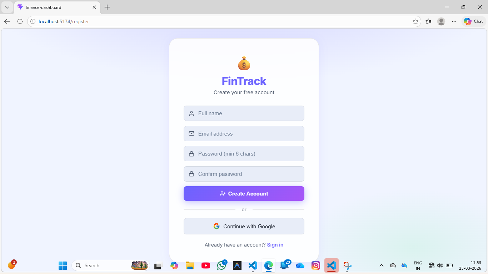
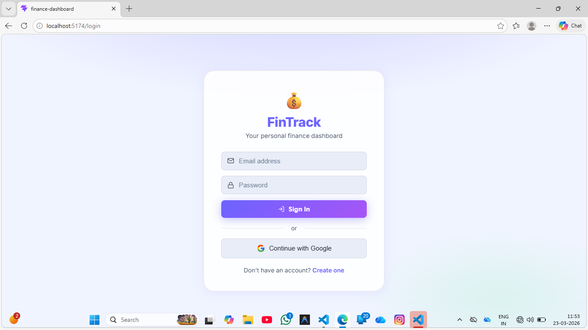
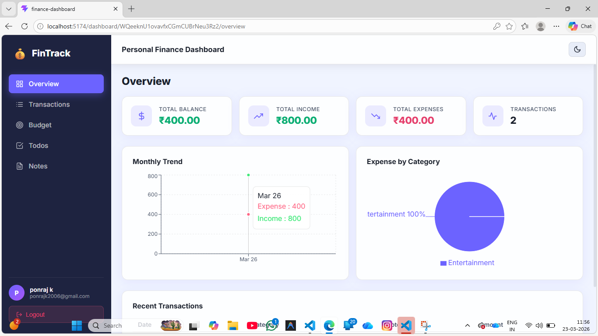
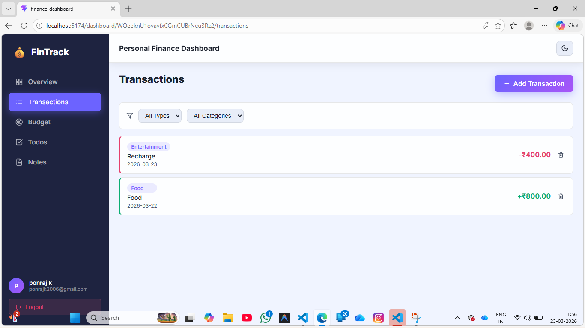
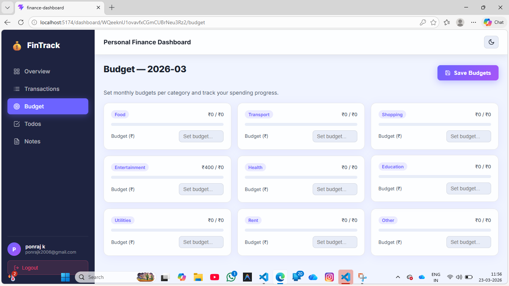
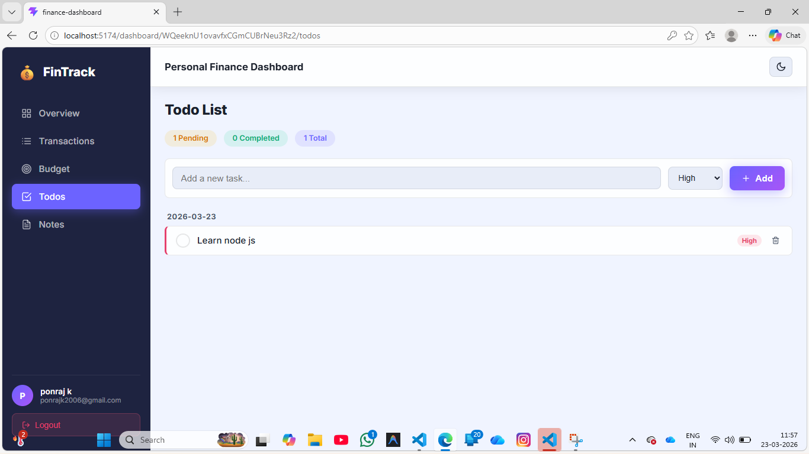
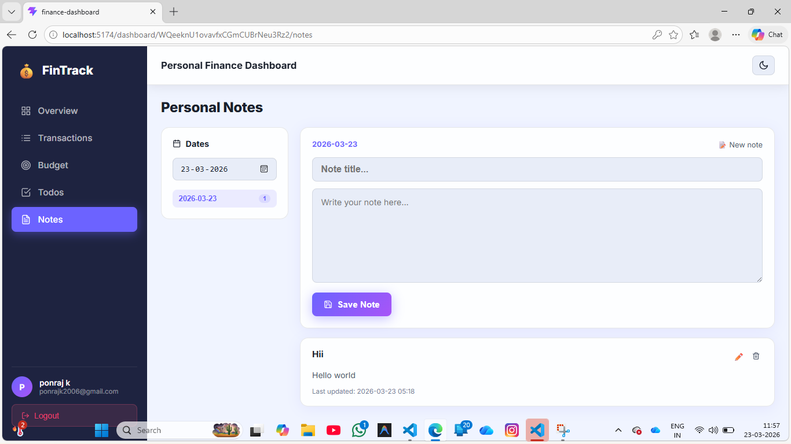

# 💰 FinTrack – Personal Finance Tracker

FinTrack is a modern web application that helps users **track, manage, and organize their finances efficiently**. It provides features like expense tracking, to-do management, and notes — all in one place with secure authentication.

---

## 🚀 Features

### 🔐 Authentication System
- User Registration (Email & Password)
- User Login System
- Google Sign-In (OAuth)
- Secure authentication using Firebase

### 💵 Finance Management
- Add, edit, and delete transactions
- Track income and expenses
- View financial data in an organized way
- Real-time data sync using Firebase

### ✅ To-Do List
- Add daily tasks
- Mark tasks as completed
- Delete tasks
- Helps users stay productive and organized

### 📝 Notes Section
- Create personal notes
- Edit and delete notes
- Store important financial reminders or ideas

---

## 🛠️ Tech Stack

### Frontend
- React.js
- HTML5
- CSS3 / Tailwind CSS / Bootstrap

### Backend / Database
- Firebase Authentication
- Firebase Firestore (Database)

### Other Tools
- Git & GitHub
- Vite (for fast development)

---

## 📂 Project Structure
``` 
FinTrack/
│── public/
│── src/
│ ├── components/
│ ├── pages/
│ ├── firebase/
│ ├── utils/
│ └── App.jsx
│── package.json
│── README.md

```
---

## 🔑 Authentication Flow

1. User must **Register first**
2. Then **Login using email/password**
3. Option to **Login with Google**
4. After login, user can:
   - Manage finances
   - Add todos
   - Write notes

---

## ⚙️ Installation & Setup

### 1️⃣ Clone the repository
```bash
git clone https://github.com/ponraj2006/FinTrack.git
cd FinTrack 
```

### 2️⃣ Install dependencies
```bash
npm install
```
### 3️⃣ Setup Firebase

Create a Firebase project and enable:

Authentication (Email/Password + Google)
Firestore Database

Create a .env file in root:
```bash

VITE_FIREBASE_API_KEY=your_api_key
VITE_FIREBASE_AUTH_DOMAIN=your_auth_domain
VITE_FIREBASE_PROJECT_ID=your_project_id
VITE_FIREBASE_STORAGE_BUCKET=your_storage_bucket
VITE_FIREBASE_MESSAGING_SENDER_ID=your_sender_id
VITE_FIREBASE_APP_ID=your_app_id

```

### 4️⃣ Run the app
```bash
npm run dev
```
# 📸 Screenshots

## 📝 Register


## 🔐 Login


## 📊 Dashboard


## 💸 Transactions


## 🎯 Budget


## ✅ Todos


## 🗒️ Notes



---
## 🌐 Live Demo

Add your deployed project link (Netlify / Vercel)

## 🤝 Contributing

Contributions are welcome! Feel free to fork the repository and submit a pull request.

## 📄 License

This project is open-source and available under the MIT License.